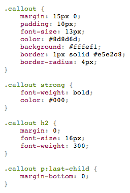

# cssprettifier-userscript

Format and syntax highlight CSS files you open.

> A [userscript](http://wiki.greasespot.net/User_script) is like a cross-browser extension that makes on-the-fly changes to specific web pages, typically to change their appearance or to add or modify functionality.


## Getting started

### [Install](http://userscripts.org/scripts/show/162004)

Available on Chrome, Firefox *(requires [GreaseMonkey](https://addons.mozilla.org/en-US/firefox/addon/greasemonkey/))*, Safari *(requires [NinjaKit](http://os0x.hatenablog.com/entry/20100612/1276330696))*, Opera.


## Overview



### Before

```css
.callout{margin:15px 0;padding:10px;font-size:13px;color:#8d8d6d;background:#fffef1;border:1px solid #e5e2c8;border-radius:4px;}.callout strong{font-weight:bold;color:#000;}
```

### After

```css
.callout {
	margin: 15px 0;
	padding: 10px;
	font-size: 13px;
	color: #8d8d6d;
	background: #fffef1;
	border: 1px solid #e5e2c8;
	border-radius: 4px;
}

.callout strong {
	font-weight: bold;
	color: #000;
}
```

A [bookmarklet](https://github.com/addyosmani/cssprettifier-bookmarklet) is also available.

Powered by [cssbeautify](https://github.com/senchalabs/cssbeautify) and [Prism](http://prismjs.com).


# License

[MIT](http://opensource.org/licenses/MIT) © [Sindre Sorhus](http://sindresorhus.com)
